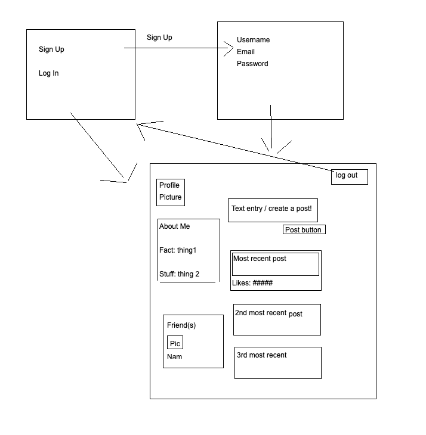

# MySpace 2003: 2
## Duncan Weir's Capstone Proposal

### Proposal:
My goal for the Capstone project is to create a working personal blog based on the design format for MySpace from when it initially launched in 2003. This page will utilize the Python framework Django to save and retrieve user information as well as to display a user's posts/feed.

### User Experience:
User's will be given a new and improved social media experience with a MySpace 2004 experienced improved for the needs of someone in the year 2020 user.

### Functionality:

#### 1. Tier 1 - Essentials:
- A sign up / log in page
- Sign up as a new user and access a user-specific page
- Log in as a pre-existing user and access your page
- Make blog posts that are displayed on the user's page
- Ability to log out from the user page > return to the sign up / log in page

#### 2. Tier 2 - Moderate:
- Auto generate a user's "profile picture" from a library of pre-selected images
- Display a number of "likes" that will automatically, indefinitely increase for every post the user creates
- Create an "About Me" section that users can customize

#### 3. Tier 3 - Stretch:
- Create a comedically long log-in flow
- Allow users to access and view other user's blog pages
- Support posting of Images in blog posts
- Play customizable music options on user pages
- Allow users to comment on user posts with pre-provided text options

### Project Tools:
1. Python 3
2. HTML/CSS
3. Django 2.2.9
4. Javascript

### Schedule:

#### Week 1:
- Create a functionining login / sign up page
- Create blog posting to user walls
- Create Log Out functionality

#### Week 2:
- Create the MySpace coloring and formatting
- Create profile image generation / saving upon neww user creation

#### Week 3:
- Create auto-liking total counter
- Create customizable About Me sections
- Create friend section pulling user names & images from database

#### Week 4:
- Extend the login process / flow
- Implement image uploading with blog posts
- Implement customizable music on user pages
