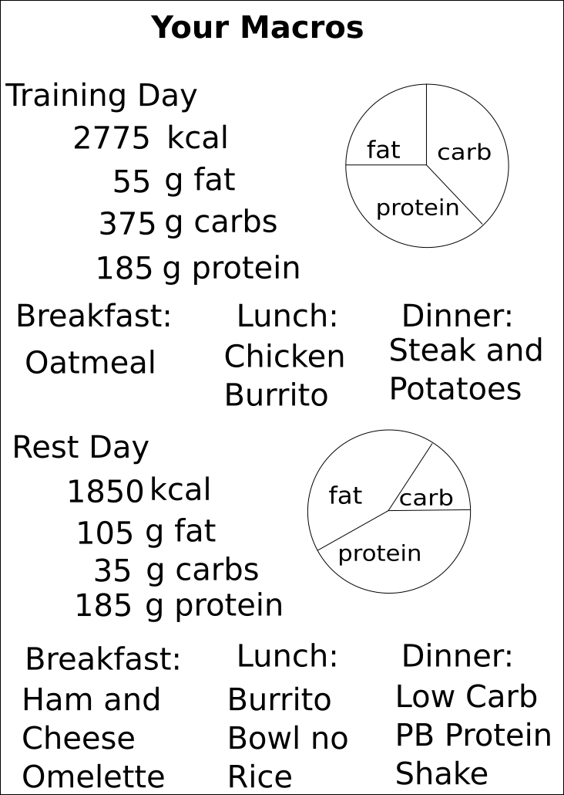

# MACRO_TRACKER PROJECT PROPOSAL

## Overview
My Capstone Project will be a Fitness Macro Calculator and Tracker.  Macros, or macronutrients, are fat, carbohydrates, and protein.  They make up almost all of our diets and provide energy.  
- ### Macro Calculator
  Macro Calculators are used to calculate the grams of fat, carbohydrates, and protein to be consumed each day.
- ### Macro Tracker
  Macro Trackers are used to record macronutrient consumption to keep dieters on track.

## User Experience
The user will complete a short form to calculate macronutrients based on their fitness goals.

The bulk of the user's experience will be with the macro tracker.  