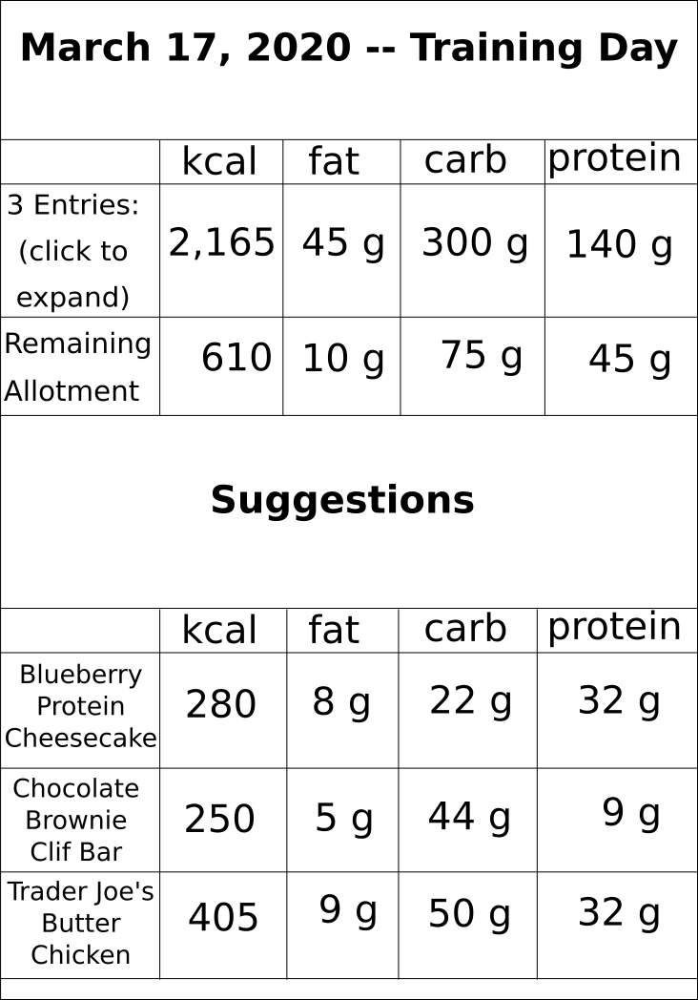
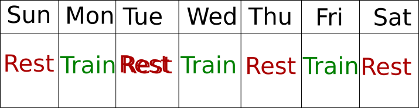

# A MODEST MACRO_TRACKER PROJECT PROPOSAL

## Overview
My Capstone Project will be a Fitness Macro Calculator and Tracker.  Macros, or macronutrients, are fat, carbohydrates, and protein.  They make up almost all of our diets and provide energy.  

- ### Macro Calculator
  Macro Calculators are used to calculate the grams of fat, carbohydrates, and protein to be consumed each day.
- ### Macro Tracker
  Macro Trackers are used to record macronutrient consumption to keep dieters on track.

For people who are willing to improve their fitness, but don't know where to start, these tools can be the difference.

## User Experience
The user will complete a short form to calculate macronutrients based on their fitness goals.

The bulk of the user experience will be with the macro tracker.  Here, the user will add meal entries to their fitness diary and see how they track with their macronutrient allotment for each day.

The project will also include some basic information for users new to fitness and/or nutrition tracking, as well as a ***robust*** FAQ to inform users on wider topics of fitness and nutrition.

## Project Goals

#### Basic Goals

* Users can calculate Macros on a 3-4 fitness schedule (3 Training Days, 4 Rest Days).

* Users can log Meals in Food Diary to see how well they meet their Nutrition Goals.

* Users can create and save their own Meals and Macros or...

* Users can choose from a ***robust*** catalog of recommended Meals, including:
  * Widely available fast casual meals (i.e.: Chipotle, Panera Bread, Subway)
  * Grocery items (i.e.: Trader Joe's frozen pizza, Clif Bar)
  * General Foods:
    * As snacks or ingredients of larger meals (i.e.: 1 apple, 1 egg, 1 cup flour, 1 chicken breast 3.5 oz)
    * Or, as simple recipes (i.e.: 4 egg cheese omelette, Protein Mac N Cheese)

* Users can log weight to Track Progress and ReCalculate Macros accordingly.

* FAQ
  * Basics of Macronutrient and Kcal counting
  * Basics of Strength Training
  * Tips for those new to dieting

#### Intermediate Goals

* The Tracker will suggest meals to fit into the user's Goal Macros, based on how the User has tracked meals throughout the day.

* Constructive Feedback based on User Performance
  * User Tiered Goals:
    * Basic Goal: Hit within 10 % of kcal
    * Advanced Goal: Hit within 5% of all Macros

* Visual Polish:
  * Responsive DOM
  * Kinetic Bars, Graphs, Numbers
  * Calendar View/Date Picker

* User Profile
  * Bio
  * Progress Pics
  * Favorite Macro Meals

* Recipe links for some meals.

* Sort meals by nutritional preference:
  * Vegetarian
  * Vegan
  * Gluten Free

* Study Macro Calculation and Revise Calculator

#### Advanced Goals:

* Implementing Nutritionix API

* Add functionality for a wider variety of:
  * Nutrition Plans (i.e.: Keto, Paleo)
  * Fitness Plans (i.e.: Running, Cross Fit, Other Strength Training Schedules than 3-4)

* Expand FAQ

* Add Workout Tracker functionality.

* Allow for increased community interaction among users:
  * Comments
  * Recipe/Meal Sharing
  * Social Media Posting

## Project Tools

* Python/Django
* JavaScript/Vue.js
* html/CSS

## Schedule

#### Week One

* Continue developing basic Django functionality:
  * Work on Meal Suggester
  * Expand General Meals
  * Clean up unnecessary functions in models.py and views.py

* Put some time into User Profiles

* Begin working on visual aspects
  * Decide how styling will be done (in Django, with vue.js?)
  * If using, say, vue.js, re-tool the project to work with sending out an API.

#### Week Two

* Complete a rough draft of styling, however it's done

* More research into possible Nutritionix API

* Work on FAQ

* Work on Constructive Feedback

#### Week Three

* Have a final decision on how styling will be done

* Work on recipe links/nutrional preference

* Advanced Visual Polish:
  * Decide what to keep/cut for Week 4
  * User Profiles

#### Week Four

* Honestly, who knows.